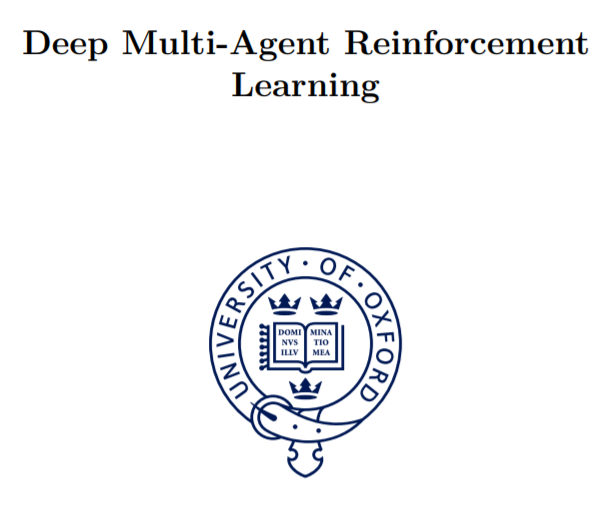

# Deep Multi-Agent Reinforcement Learning

안녕하세요. 김설호입니다. 이번에 COMA로 유명해진 Foerster의 박사학위 논문을 번역해보는 시간을 가져보았습니다. 누군가 "Multi-Agent RL을 배우고 싶은데 이게 최선이야?" 했을 때, 이 글은 아닐 수 있습니다. 하지만 좀 더 본질적으로, "이런식으로 번역한걸 보는 것이 정말 의미가 있어?" 했을 때 저는 충분히 서로에 Yes라고 생각하고 있습니다. 

 혼자 논문을 즐겨 읽는 저로서 항상 아쉬웠던 점은 내가 지금 이해한 것에 대해 다른 사람은 어떻게 생각할까에 대한 해소가 힘들었던 점입니다. 이 번역을 통해 저와 같은 애환을 가진 많은 분들에게 조그만 도움이 되었으면 좋겠습니다 :\)

 "이 thesis가 MARL의 정도냐" 했을 때, 이 질문에 대답은 완전히 No라고 생각합니다. 하지만, 애초에 어느 학문의 길에도 정도는 없다고 생각합니다. 이 thesis를 보고 충분히 MARL가 직면하고 있는 문제점들과, 이를 해결하기 위한 노력들에 대해 이해할 수 있었고, 내용이 딱딱하지 않아서 좀 더 쉽게 핵심들에 접근할 수 있었다고 생각합니다.

 우리가 비동기적으로 만나서 함께 같은 공부를 하고있다는 사실은 같아도, 과거의 배움은 각자 다른 길을 걸어왔을 것입니다. 의견이 다른, 혹은 보충해주시려는 분들의 다양한 의견들을 기쁜 마음으로 받아들이겠습니다.

내용은 [이곳](https://ora.ox.ac.uk/objects/uuid:a55621b3-53c0-4e1b-ad1c-92438b57ffa4)에서 확인 가능합니다. permission을 얻은상태이고, 단기간에 빠르게 완성하기 위해 많은 부족한 부분이 존재하는데 유의해서 읽어주셨으면 좋겠습니다.

Written by Jakob N. Foerster

Translated by [Seolho Kim](https://seolhokim.github.io/about/)

