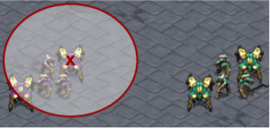
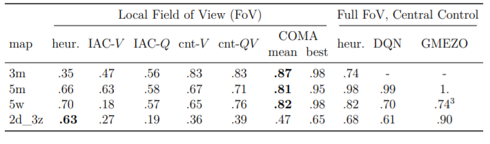

# 3.3 Multi-Agent StarCraft Micromanagement

이번 section에서는 COMA에서 정의한 StarCraft micromanagement problem에 대한 설명과 state에 대한 설명을 할 예정입니다. 

### Decentralised StarCraft Micromangement

여기서는 각각의 유닛들이 적과 싸우기 위해 이동하는 것과 공격을 각 decentralised agent의 action으로 정의합니다. 그래서 주로 여기선 3대3 , 5대5 마린전, 5대5 질럿전, 2드라군 3 질럿전에 대한 실험을 진행하고, 이때 반대편 상대는 starcraft내의 heuristic rule based ai를 상대합니다.

다음과 같은 discrete action set을 정의하는데, 이동\(방향으로 정의\), 공격\(target 별 정의\), 멈춤\(stop\), 아무것도 안함\(noop\)으로 정의했습니다. 실제 게임에서는 유닛이 공격을 하기 위해선 자동으로 공격가능한 사거리까지 이동 후 공격하는데,\(게임 내 만들어진 pathfinding route를 통해\) 이는 문제를 좀 더 쉽게 만들어 줍니다. 하지만 여기선 decentralised를 좀더 의미있게 하기 위해, agent별\(unit별\) 시야를 공격가능범위로 제한하였는데, 드라군의 시야범위를 예로 나타내자면 다음과 같습니다.

이러한 decentralisation를 통해 생기는 특징은 다음과 같습니다.

* agent들이 더이상 fully observable state를 이용할 수 없습니다.
* agent는 오직 적이 내 공격가능 범위 내에 있을 때만 공격합니다.\(여긴 반대로 쓰여져있는 것 같은데, 이 말이 맞는 것 같습니다.\) 그렇기 때문에 공격을 위해 이동해야하는 등의 built-in macro-action을 사용하지 않습니다.
* agent는 어떤 적이 죽었고 어떤적이 내 시야에 벗어났는지 인식하지 못합니다. 그렇기때문에 이는 action space의 invalid choice를 어떻게 처리하느냐가 문제가 될 수 있는데 이는 noop으로 처리됩니다.

이렇게 좀더 어려워진 환경 때문에 여기서는 일단 적은 유닛만을 가지고 해결하는데, 결과적으로 다음과 같은 승률을 얻었습니다. 이때 heuristic한 policy는 agent들을 전진하게하고 한 유닛에 화력을 집중해 죽이는 방식인데 결과를 보면 생각보다 괜찮은 방식임이 틀림없는데, Local observable하게 되었을 때 전체적으로 모두 승률이 낮아짐을 볼 수 있습니다. 이 실험에서 좋은 결과를 얻기 위해선 agent끼리 위치선정을 잘하고, 화력을 집중할 수 있고, 적이 죽은건지 시야밖으로나간건지 구별을 잘 해내야 하는 능력이 필요합니다.

팀 내의 모든 agent\(당연하겠지만 반대편은 아예 agent로 신경쓰지 않는 환경입니다\)는 같은 global reward를 받으며, 상대방에게 가한 데미지만큼 +, 받은 데미지의 절반만큼 -, 적 유닛을 죽였을 때 +10, 이겼을 때 전체 팀 에너지에 + 200을 받게 됩니다. 

### State Features

actor와 critic이 받는 input features에 대한 설명입니다. agent와 critic이 받는 정보가 다른데, agent가 받는 local observation으로는 agent의 시야 반경내의 유닛에 대한 거리, 상대적인 x,y, 유닛의 타입과 실드량이 있고, 모두 normalized됩니다. 또한 현재 agent가 공격 대상으로 잡은 유닛에대한 정보는 아무것도 받지않습니다.

critic이 받는 global state는 모든 유닛의 맵의 중앙과의 거리, 모든유닛의 에너지 및 공격 쿨다운등이 들어갑니다. 또한 agent들의 local observation도 input으로 받는데, 이는 다른 새로운 정보는 없지만 agent끼리의 상대적인 거리등에 대한 정보를 \(global state에서 표현한 것관\)다르게 표현해서 얻게됩니다.

