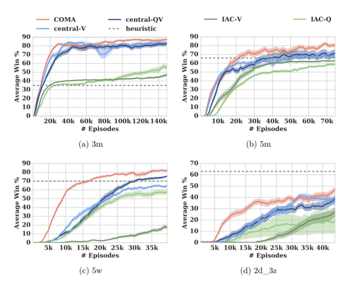

# 3.5 Results

위의 결과에서 보듯, COMA는 모든 IAC보다 월등한 성능을 보입니다. 보면 IAC가 어느정도 reasonable한 성능을 내긴 하지만 수렴속도가 제일 느린데, 이는 IAC의 parameter가 적어서 빨리 학습될거라는 intuition과 반대됩니다. 이러한 결과는 global state를 통해 얻은 좋은 critic이 네트워크를 분리하는 것의 오버헤드를 압도했음을 나타냅니다.

또한, central-QV보다 COMA가 학습속도나 성능에서 모두 우월한 성능을 보였는데 이는 counterfactual baseline이 유효함을 드러냅니다. 

결과적으로, Usunier의 실험은 좀 더 환경이 덜 제한이 되었으나 성능은 비교할만하다는 것을 볼 수 있습니다.

