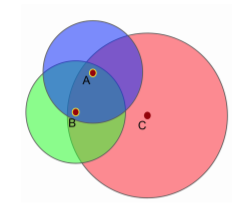

# 4.1 Introduction

이전의 chapter에서 cooperative한 상황에서 어떻게 centralized value function을 가지고, credit assignment problem을 해결할지에 대해 생각해보았습니다. 이러한 문제에 대해 많은 진척 사항들이 생겼지만, 이 fully decentralized agent는 agent간의 협동하는 능력에 대해 많은 제한이 있을 수밖에 없습니다. 또한 가끔 agent들은 그들 스스로 관측한 좋은 observation에 대해서도 무시하는 경향이 있는데 이는 팀 전체로 보았을 때, 내가 이 행동을 하더라도 다른 agent들이 예측가능하지않다면 전체 reward를 높이는데 어려울 수 있기 때문입니다. 이 chapter에서는 그렇기에 Multi-Agent Common knowledge Reinforcement Learning\(MACKRL\)을 제안하는데, 이는 그 두가지의 극한의 중간 영역을 찾도록 돕습니다. 이 것의 메인 아이디어로는 partially observable 상황에서 agent끼리 그들끼리 행동을 조율할 수 있도록 돕는 Common Knowledge를 가질 수 있다는 점입니다. Common Knowledge의 정의는 다음과 같습니다. 각 agent들이 모든 다른 agent들이 아는 것을 알고, 각 agent들이 다른 agent들이 모든 agent들이 알고있다는 것을 알고있는 것을 말합니다. 직관적으로 common knowledge는 서로의 상태를 서로 확인할 수 있을 때, 불확실하던 것이 사라지며 충족됩니다. 이는 다음 그림을 보며 자세하게 보겠습니다.

각 원은 각 agent 자신의 observation입니다. 이 상황에서 A와 B는 서로 관측가능하므로 Common Knowledge가 있다고 말할 수 있지만, C는 A와 B가 관측할 수 없는 위치에 존재하므로, 이는 Common Knowledge를 공유한다고 할 수 없습니다. 이는 축구같은 군집화된 상황에서 충분히 생각해 볼 수 있습니다. Common knowledge를 사용하는 것은 생각보다 꽤 유용한데 이는 그룹내의 각 agent가 스스로 그룹 내에서 공유되는 common knowledge를 추론할 수 있기 때문입니다. 결과적으로, common knowledge에 기반한 centralized joint policy가 decentralized된 방식으로 실행됩니다. 각 agent는 단지 centralized policy에서 어떤 action을 실행할지만 전달받으면 됩니다. 각 agent는 같은 common knowledge를 input으로 받기 때문에 같은 joint action을 선택하고, 협력된 행동을 할 수 있게 됩니다.

그러나, common knowledge의 도입으로 인한 새 문제점이 생기는데, 작은 그룹일수록 겹치는 common knowledge가 많아 공유하는 양이 많겠지만, 어떤 레벨에서의 협력을 해야할지 불명확할 수 있습니다. 반대로, 협력이 완전히 전반적으로 일어난다면, fully centralized policy가 선택되겠지만, 공유할 수 있는 양이 적어 최적의 결과를 내는데는 부족할 수 있습니다. 

그렇기 때문에, MACKRL에서는 한 팀을 얼마나 작은 그룹으로 쪼갤 것인가 결정하는것이 굉장히 중요합니다. 여기서는 계층적인\(hierarchy\) 접근을 시도했는데, 각 hierarchy에서 agent는 각 그룹내에서 joint action을 선택할 것인지, 더 작은 subgroup로 나뉠건지를 선택하는데, 그 controller의 action은 그러면 다음  hierarchy에 있는 controller로부터 선택되게 됩니다.\(여기서 agent는 controller와 완전히 같은 개념이 아닙니다.\) MACKRL에서의 action selection은 단순히 hierarchy에 있는 controller에 의한 sampling으로 볼 수 있습니다. 그러나 학습 중간에 joint action에 대한 marginality는 각 hierarchy마다 취할 수 있었던 모든 action 선택에 대해서 이뤄집니다. 그러므로, subgroup이 가진 parameter들이 action selection이 되지 않더라도, gradient를 받을 수 있습니다.

MACKRL을 쉽게 구현한 pairwise MACKRL을 보이는데, 이는 starcraft2 환경에서 centralized critic을 사용하는 agent baseline을 모두 압도하는 성능을 보입니다. 또한 하위 hierarchy로 결정을 넘기는 것과 common knowledge의 양 간의 유의미한 관련성을 보입니다.

