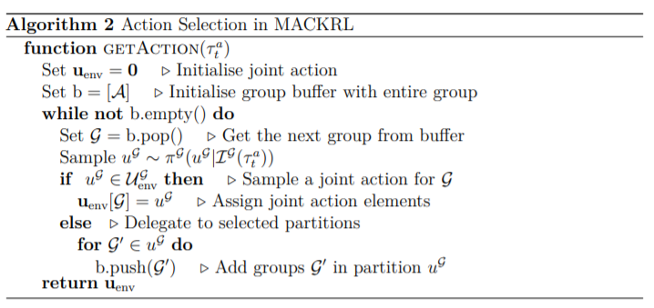
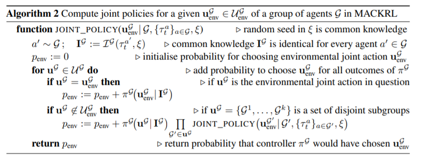

# 4.5 Multi-Agent Common Knowledge Reinforcement Learning

MACKRL의 주요 포인트는 decentralized policy이지만 협력하는 것을 배운다는 점입니다. MACKRL은 common knowledge를 공유하는 agent들 끼리의 joint policy $$ \pi^\mathcal{G}(\bold{u}^\mathcal{G}_{env}|\mathcal{L}^\mathcal{G}(\tau^a))$$를 만드는데 이는 centralized하게 행동하지만,  decentralized한 방법으로 학습됩니다. \(뒤에서 좀더 자세히 설명할 것입니다.\) 모든 agent는 common knowledge와 같은 random seed를 통해 그들이 속한 그룹의 joint action에서 action을 sampling하는 형식으로 이루어 집니다. 이때 common knowledge가 충분한 정보를 가지고 있으면, 그룹의 policy는 꽤 좋은 joint action을 내놓을 것입니다. 하지만, 충분하지않다면 작은 subgroup으로 분할됩니다. subgroup간에는 더이상 협력이 일어나진 않지만,\(joint action select에 서로 영향을 미치지않지만\) 더 풍부한 common knowledge를 사용할 수 있을 것입니다. 이 모든 과정은 partially observable 했던 trajectories를 통한 common knowledge $$ \mathcal{L}^\mathcal{G}(\tau^a)$$에 의해서만 일어나므로 decentralized되었다고 볼 수있습니다. 이러한 아이디어를 실현하기 위해 hierarchy controller를 사용하였는데, 맨 상단과 중간 level의 controller에서는 joint action을 select하거나, subgroup으로 나누는 역할을 하고, 맨마지막에선 joint action에서 action을 select하는 행위를 합니다.

### Algorithm

이를 수도코드화 하면 다음과 같습니다.

알고리즘 설명이 너무 잘되어 있어 line by line 설명은 하지 않고, 전체 flow를 한번 다시 보겠습니다. b는 agent 그룹입니다.

b에 더이상 그룹이 없다면 멈추게 되는 loop를 만듭니다.

b에서 그룹하나를 pop한뒤, 그 그룹에서의 joint action $$u^\mathcal{G}$$를 sampling합니다.

만약 이 joint action $$u^\mathcal{G}$$가 $$u^\mathcal{G} \in \mathcal{U}^\mathcal{G}_{env}$$라면, joint action에 선택되고, 그게 아니라면, 쪼개져 b로 들어가게 됩니다. 그렇게해서 joint action $$ \bold{u}_{env}$$가 선택됩니다.

 $$u^\mathcal{G} \in \mathcal{U}^\mathcal{G}_{env}$$가 아니라는 뜻은, $$ u $$내에 환경에서 실행될 수 없는 delegate action이 포함되어 있다는 뜻입니다.

 이 알고리즘에서 필요한 점은 그렇다면 어떻게 groupping을 해서 b에 넣어둘 것인가가 중요해집니다.

### marginality of policy probability

policy에 대한 marginality를 구하기 위해서 joint policy probability는 다음과 같이 표현할 수 있습니다. 

                                     $$ P(\bold{u}_{env}|s) = \sum_{\mathrm{path \in Paths}}{P(\bold{u}_{env}|s,\mathrm{path})P(\mathrm{path}|s)}$$

Paths는 hierarchical controller가 할 수 있는 모든 action에 대한 경우로, path는 action selection을 통해 얻은 가능한 결과값중 하나입니다. 하지만 agent가 많아질 수록, 이 path에 대한 개수는 exponential하게 증가합니다. 또한 joint probability는 central state information이 필요한데, 이는 더이상 decentralized 되었다고 할 수 없게됩니다. 

하지만 MACKRL에서는 marginal probability는 joint probability를 뽑는 probability만 구하면 되기 때문에 조금 더 계산량이 적습니다. 이는 다음과 같은 알고리즘으로 계산할 수 있습니다. 필요한 설명은 이미 다 끝났으므로 쉽게 이해하실 수 있습니다.

### Training

학습은 actor-critic form으로 진행되는데, centralized value를 사용하지만 MACKRL이 joint action space에 대해 correlated probability를 계산해야하기 때문에 COMA의 baseline의 적용을 하진 못했습니다.

gradient parameter $$ \theta$$에 대해 policy는 다음의 식으로 update가 진행됩니다.                       

                             $$ \nabla_\theta J_t = (r_t+\gamma V(s_{t+1},\bold{u}_{env,t}) - V(s_t,\bold{u}_{env,t-1}) \nabla_\theta\log(p(\bold{u}_{env,t}|s_t))$$

 하지만 많은양의 partition과 partition당 그룹의 개수는 학습을 어렵게 하는 요인인데 다음장에선 이를 단순화해 쉽게 다룰 수 있는 방법에 대해 설명합니다.

