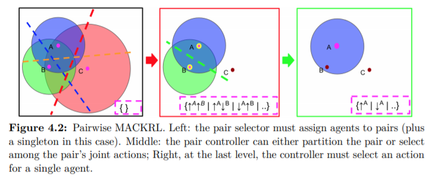

# 4.6 Pairwise MACKRL

이번 chapter에서는 MACKRL의 간단한 구현체 pairwise MACKRL에 대해 설명합니다. 여기에는 3가지 단계의 hierarchy가 있습니다. 

* top 단계에서 controller $$ \pi_{ps}$$는 pair selector로 직접적으로 joint action selection을 하진 못하고, 오직 쌍으로 파티션을 진행합니다. 즉 agent들을 disjoint하게 다른 그룹으로 만드는 것을 의미합니다. 만약 agent의 개수가 홀수라면, 나머지 하나의 agent는 나머지 그룹으로 만듭니다.
* second 단계에서는 각 controller $$ \pi^{aa'}_{pc} $$는 pair controller로, 이 controller의 action space는 두 쌍의 agent에 대한 joint action space로 이루어져 있습니다. 거기에 더해서 delegate action $$ u_d$$이 있는데 이는 이를 더 쪼갤 수 있느냐에 대한 action 입니다. 그렇기 때문에, 이 action space의 크기를 나타내면 다음과 같습니다. $$ \mathcal{U}^\mathcal{G} = \mathcal{U}^a_{env} \times \mathcal{U}^{a'}_{env} \cup\{u_d\}$$
* 마지막 단계에서는 각자의 controller가 single agent에 대한 action a 를 고릅니다.

이를 그림으로 설명하면 다음과 같습니다.

