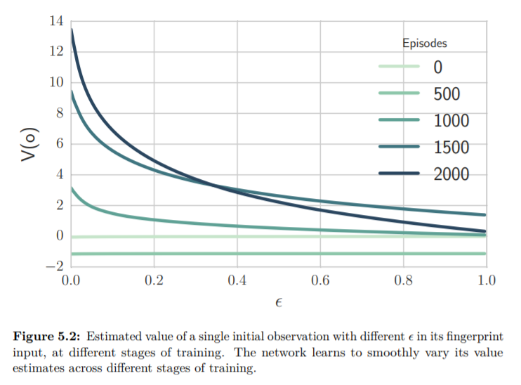

# 5.5.2 Fingerprints

여기선 exploration rate$$\epsilon $$와 episode $$e$$를 finger-print로 사용한 실험을 보이는데, XP+FP한 결과가 그래프에서도 확실히 좋은 결과를 보이는 것을 볼수 있습니다.이는 finger-print가 다른 agent의 policy에 대한 적당한 지표를 전달해 주었음을 의미합니다. network는 여전히 다양한 input state를 보지만, finger-print로 인해 알려진 training의 어느 상태인지에 맞게 잘 mapping해 내는 것을 볼 수 있습니다.

XP+IS+FP의 결과를 보면 agent의 성능이 더 나아지지 않았는데, 이는 둘다 같은 문제를 해결하려 하기 때문에, 더 성능이 나아지지 않았다는 것은 둘이 비슷한 역할을 한다는 것을 의미합니다.

다음 그림에서는 episode에따른 $$ \epsilon $$의 감쇄와 그에 따른 value function을 나타냅니다.

이는 학습이 진행될수록, 같은 state라도 $$\epsilon$$가 작을 때 높은 value function을 가졌는데 이는 다른 agent의 policies에 맞는 최적의 반응을 했다고 볼 수 있습니다.

