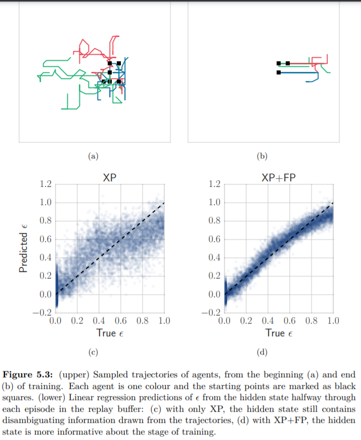

# 5.5.3 Informative Trajectories

Recurrent network를 사용할 때, 3대3상황에서 XP가 XP+IS와 XP+FP으로 얻었던 차이는 생각보다 크지 않았습니다. 이는 observed trajectories가 활용하기 좋은 정보를 가지고 있었기 때문입니다.

\(a\)와 \(b\)는 학습 초기의 agent들의 움직임과 학습 후기의 agent움직임을 나타낸 것입니다. agent는 현재 많은 random action이 행해지는 것을 관찰하고, 그것이 학습 초반에 온 것임을 알 수 있는데 이는, 추가적인 정보없이도 이 학습 초반인 것을 이해해낼 수 있기 때문입니다. 이를 설명하기 위해 아래의 그림을 보면, \(c\)는 오직 recurrent network만 사용했는데도 $$\epsilon$$을 예측하는데 꽤나 좋은 양의 상관관계를 보임을 알 수 있습니다. 물론 FP를 사용했을때 더욱 잘 예측해냈지만, 이를 통해 Recurrent Network가 MARL에서 자주 쓰이는이유를 알 수 있었습니다.

