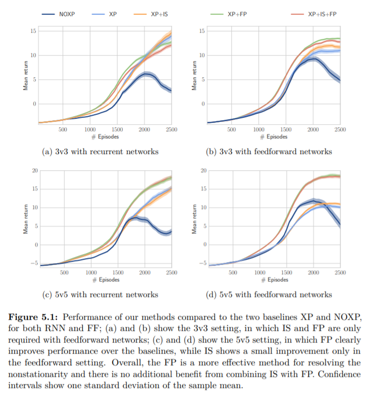

# 5.5 Results

이번 section에서는 Starcraft에 대해 실험을 진행한 내용에 대해 아래 그림을 가지고 설명합니다.

모든 task와 model에 대해서 experience replay를 쓰지 않은 agent\(NOXP\)는 성능이 안좋았습니다. experience replay가 제공해주는 다양한 trajectories없이는 NOXP는 overfit됩니다. explorationary action이 발생하면 Q-value로부터 자추 업데이트되지 않은 곳에 agent가 가게되고, 이는 Q-function가 왜곡되거나 오래된 Q값을 이용하게 된다는 것을 의미합니다. 이는 policy전체에 해로운 영향을 끼칩니다.이때 Recurrent network는 그나마 덜 영향을 받는 편이지만, fully connected layer는 성능이 급격하게 안좋아지기 시작합니다. 그렇기때문에 trajectories에 모두 접근할 수 있는 experience replay를 이용하는 것 자체가 single observation만을 사용하는 것보다 본질적으로 안정적인 exploration을 진행할 수 있습니다. 그리고 이는 fully connected agent에 더욱 필요합니다.

Experience replay만을 사용하는 agent는\(XP\) policy가 예전의 다른 agent들의 policies에 대응하는 최적의 반응을 배우는 시도를 할 것인데, 이러한 non-stationarity에도 불구하고, NOXP보다도 안정적인 성능을 보였습니다. 하지만 agent가 experience replay를 통해 다른 agent들의 행동에 대해 좀 더 명확한 정보를 얻을 수 없고, 결과적으로 experience replay를 반쪽만 가지고 활용하는 것과 같습니다. 이는 agent를 잘 generalization하기 어렵습니다.

