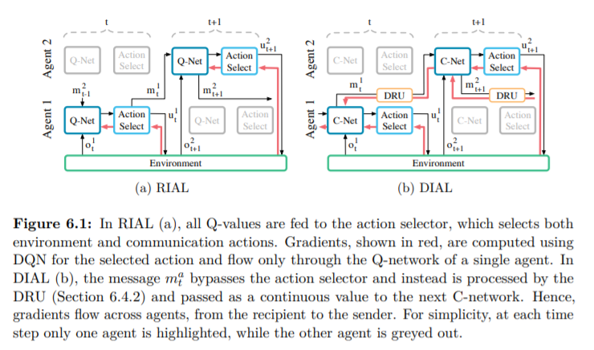

# 6.4.2 Differentiable Inter-Agent Learning

 RIAL이 parameter sharing을 한 것은 agent가 communication action에 대한 피드백을 주지 못한다는 점에서 communication 학습에 있어 centralized learning의 모든 장점을 사용한 것이 아닙니다. 반면에 사람들의 communication을보면, 굉장히 풍부하고 밀접하게 피드백이 돕니다. 예를들면, 청취자는 화자에게 이해 정도와 흥미를 바로바로 비언어적인 표현을하며 대화가 이어집니다. 이러한 피드백이 communication protocol에 있어서 굉장히 중요하지만 RIAL은 이에 대한 학습 메커니즘이 부족했습니다. 여기선 이러한 제한을 해결하기위해 Differentiable inter-agent learning\(DIAL\)을 제안했습니다. DIAL의 RIAL과의 가장 큰 차이점이자 communication을 학습하기 위한 원리는 gradient를 한 agent로부터 다른 agent의 communication channel을 통해 전달한다는 점입니다. 그렇기 때문에, communication에 대한 학습이 RIAL는 각 agent내에서\(within\) 학습이 이루어졌다면, DIAL은 agent를 넘어서\(across\)학습이 이루어집니다. 이러한 방식은 더 많은 communication에 대한 좀 더 많은 feedback을 할 수 있다는 것을 의미합니다.

DIAL은 다음과 같이 작동합니다. centralized learning을 하며, communication action이 agent끼리의 연결을 대체합니다. 이 communication action은 agent끼리 자유롭게 어떤 discrete한 message를 주고 받는 형식으로 communication이 제한됐음을 의미합니다. 이러한 messages는 다른 network action의 학습처럼 channel을 통해 back-propagation되어 학습됩니다.

이러한 network를 여기선 C-Net이라고 칭합니다. 먼저 그림을 보자면 아래 그림의 우측과 같습니다.

이 C-Net은 두가지 타입의 구성 요소를 가집니다.

* 첫째로 $$Q(\cdot)$$입니다. Q-value가 이후 action selector에게 넘어갑니다.
* 둘째로, message$$m^a_t$$입니다. 이는 action selector에게 넘어가 다른 agent에게 전달됩니다. 이때 그림에서처럼 다음 단계에서의 DRU에 의한 어떤 처리가 이루어지는데 이를 알아보겠습니다.

ㅇ DRU는 centralized learning동안 message $$m^a_t$$를 regularization하는 역할을 합니다.   

                                                            $$ \mathrm{DRU}(m^a_t) = \mathrm{Logistic}(\mathcal{N}(m^a_t,\sigma))$$

학습할 땐, 다음과 같이 regularzation을 하고,\($$\sigma$$는 channel에 더해진 noise의 sd입니다.\) execution땐 message가 0보다 크다면 1 아니면 0으로 진행합니다. 이를 나타내면 indicator function을 이용하면 다음과 같이 표기할 수 있습니다.

                                                                    $$ \mathrm{DRU}(m^a_t) = \bm{1}\{m^a_t>0\}$$

또한 위의 그림을 보면, gradient가 어떻게 흐르는지 볼 수 있습니다. RIAL과 DIAL모두 DQN loss에 기반하는데, DIAL의 message $$m$$에 대한 error는 받은 agent로부터 보낸 agent로 back-propagated됩니다. 그렇기 때문에 좀더 communication에 대한 좀더 풍부한 signal을 받아 학습이 촉진됩니다. DQN error는 선택된 action에 대해서만 update되는데 message는 m차원의 vector이기 때문에 좀 더 많은 정보를 가지고 있습니다.

여기서는 discrete message만을 다루는데, 쉽게 continuous protocol로 확장가능하며, 큰 discrete message space로도 확장가능한데 이는 one-hot encoding이 아닌 binary encoding을 통해 이루어집니다.

