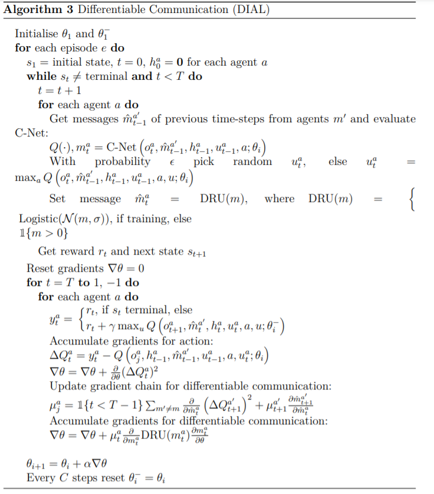

# 6.5 DIAL Details

좀 더 자세하게 DIAL의 알고리즘에 대해 알아보겠습니다. 아래 그림처럼 C-Net은 다음과 같은 input과 output을 가집니다.

                                        $$Q(\cdot),m^a_t = \mathrm{C-Net}(o^a_t,\hat{m}^{a'}_{t-1},h^a_{t-1},u^a_{t-1},a;\theta_i)$$

agent a의 observation, 다른 agent로부터 받은 message, hidden state, 이전 action, 그리고 agent에 대한 index를 input으로 가지고, output으로 Q값과 message를 가지게 됩니다. action select은 $$\epsilon$$-greedy하게 뽑기만 하면 되므로, 어렵게 생각할 것은 없습니다. 모든 agent의 action이 이렇게 선택되게 되면, environment에 전달되고, 그로인해 state가 바뀌고, 그에 따른 reward를 받게됩니다. 

 이렇게 반복되어 마지막 state에 도착하거나, 정해놓은 마지막 time-step에 도달하면, 그에 따라 update를 진행하면 됩니다. 이 때, target network에 의해 만들어진 $$y^a_t $$를 사용한 l2 loss를 구해 Q-network는 업데이트하면 되고 이제 message를 어떻게 업데이트할 건지 보겠습니다.

message는 두 가지 loss로 구성되는데, message $$m^a_t$$에 대해서 l2 loss를 구하고\(그렇게 하기 위해선 t+1의 Q값을 사용해야합니다.\),또한 message $$m^a_t$$가 agent $$a'$$에 미치는 미래의 reward에 대해 계산해야합니다. 그렇기 때문에, agent $$a'$$의 gradient를 곱해서 loss를 하나 더 구해줍니다. 

decentralized execution때는 message를 discrete하게 전달하면되기 때문에, discrete message가 전달된다고 할 수 있습니다.

continuous 한 communication을 discrete하도록 학습시키기위해 두가지 방법이 사용됩니다. 하나는 Gaussian noise를 넣는 것\(noise를 통해 message의 값이 중간에 위치하는 것을 방해하도록 합니다.\), 그리고 logistic function을 통해 정보의 범위를 제한시키는 것 입니다. 이는 정보를 regularization합니다. 이 것이 알고리즘의 전부인데, 수도코드를 통해 다시 한번 확인해보면 좋겠습니다. 

특징으로는 앞에서 나왔지만 Target Network는 사용하지만 Experience Replay가 존재하지 않고, joint action을 고려하지 않는 점이 있습니다.

