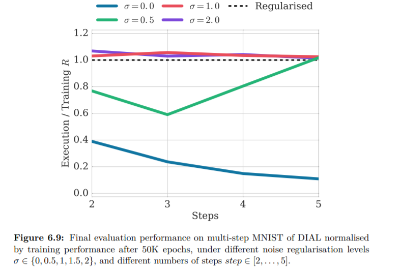

# 6.6.4 Effect of Channel Noise

noise $$ \sigma$$가 어떻게 communication channel에 영향을 주는지에 대해 알아보겠습니다. 첫번째 직관은 sigmoid의 특성을 통해 알아볼 수 있습니다. 이는 x의 값에 따라 y값은 \(0,1\)로 대응시킬 수 있습니다. 이 때, y의 0.01와 0.99범위내에 들어오기위한 x의 범위를 10정도로 생각했을 때, x는 표준편차에 6배정도는 떨어져있어야 하고, 이는 $$ \sigma = 2$$정도로 표현할 수 있습니다. 요구되는 $$ \sigma$$를 이해하기 위해 channel  logistic function과 Gaussian noise가 포함된 channel의 1회 정보 전송가능양에 대한 시각화를 해볼 수 있습니다. 그렇게 하기 위해, 먼저 message $$m$$을 받았을 때, 다음 message $$\hat{m}$$을 보낼 확률에 대해 분포를 따져보아야 합니다. ~~이는 다음과 같이 표현 가능합니다.~~

                                                $$ P(\hat{m}|m) = \frac{1}{\sqrt{2\pi\sigma}\hat{m}(1-\hat{m})}\exp(-\frac{(m-\log(\frac{1}{\hat{m}}-1))^2}{\sigma^2})$$

~~어떤~~ $$m$$~~에 대해서도 channel을 통해 나가는 message~~ $$ \hat{m}$$~~는 다음과 같은 분포를 따릅니다.~~ ~~메세지~~$$m$$~~은  보내는 message~~ $$\hat{m}$$~~이 겹칠확률이 적을 때,~~ $$m_1$$~~와~~ $$m_2$$~~로 구별될 수 있습니다.~~ 

~~따라서~~ $$m_1$$~~가 주어지면, 우리는~~ $$m_1$$~~가 생성할 가능성이 가장 높은~~ $$\hat{m}_1$$~~값이~~ $$m_2$$~~가 생성할 가능성이 가장 낮은~~ $$ \hat{m}_2$$~~값보다 작을 때~~ $$m_2$$~~를 다음 값으로 선택할 수 있습니다. 이런 가정은 다음의 수식이 만족할 때 발생합니다.~~

                ~~~~$$(\max_{\hat{m}}\ s.t.P(\hat{m}|m_1)>\epsilon) \ \ = (\min_{\hat{m}}\ s.t.P(\hat{m}|m_1)>\epsilon) $$~~~~

~~~~

흥미로운 사실은 어느정도의 noise가 channel을 regularization하는데 꼭 필요하다는 점입니다.

위의 그림은 더 많은 reward를 만들어내지 않는 communicaiton에 대한 실험입니다. 작은 크기의 noise는 discretization을 하는데 문제가 있진 않습니다. 왜냐하면 이는 activation을 sigmoid의 좌우 tail로 밀면서 reward를 최대화 하려하기 때문입니다. 위의 실험은 Regularized를 넘으면, discretization 후에 training보다 성능이 좋았다는 뜻인데, channel이 잘 regularization되었고, 이를 0과 1의 bit로 이용한다는 뜻입니다. MNIST실험에서 10개의 숫자는 encoding하기 위해 4개의 bits가 필요한데, step이 줄을수록 channel에 정보를 더 담는것이 이득이 됩니다. 이는 discretzation에 큰 방해가 되는데, noise가 적으면 이렇게 training때 continuous 함을 이용해 더 많은 정보들이 담기므로 제대로 regularization을 해내지 못하는 것을 알 수 있습니다. 

