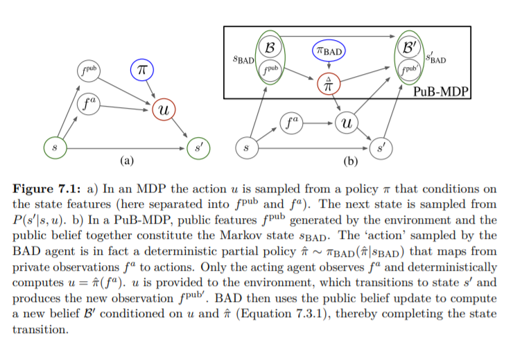

# 7.3.2 Public Belief MDP

$$\hat{\pi}$$와 $$u^a_t$$는 public information이므로, $$u^a_t$$를 관측한 것은 이후의 가능한 private state feature $$f^{pri}_t$$를 유도합니다. 이는 자세히 말하면 $$P(f^a_t|u^a_t,\mathcal{B}_t,f^{pub}_t,\hat{\pi})$$를 이야기 합니다. 그리고 이는, $$ \mathcal{B_t}$$와 $$f^{pub}_t$$를 알고 $$\hat{\pi}$$가 뽑힌 상황에서$$u^a_t$$가 뽑혔을 때, 이를 $$ \mathcal{B_t}$$와 $$f^{pub}_t$$를 안상태에서 관측할 확률과 $$f^a_t$$와 $$\hat{\pi}$$를 안상태에서 $$ u^a_t$$를 뽑을 확률과 같습니다. 

                     $$ P(f^a_t|u^a_t,\mathcal{B}_t,f^{pub}_t,\hat{\pi}) = \frac{P(u^a_t|f^a_t,\hat{\pi})P(f^a_t|\mathcal{B}_t,f^{pub}_t)}{P(u^a_t|\mathcal{B}_t,f^{pub}_t,\hat{\pi})}$$

그리고 이는 당연히 $$\propto \bm{1}(\hat{\pi}(f^a_t),u^a_t)P(f^a_t|\mathcal{B}_t,f^{pub}_t)$$에 비례합니다.

이를 통해 우리는 새로운 MDP인 PuB-MDP를 생각할 수 있습니다. 아래 그림의 \(b\)를 살펴보겠습니다.

 PuB-MDP의 state 에 대해 $$s_{\mathrm{BAD}} \in S_{\mathrm{BAD}}$$는 public observation과 public belief로 이루어져있습니다. deterministic partial policies는 private observation을 통해 action 으로 mapping합니다. 이를 transition probability로 나타내면 다음과 같습니다.

                                                        $$P(s'_{\mathrm{BAD}}|s_\mathrm{BAD},\hat{\pi})$$

다음 state는 새로운 public belief를 가지고 있으니, 이를 public belief update식을 통해 구할 수 있습니다. 이때,  일반 MDP에서는 action에 의해 transition probability가 정의되지만 여기서는 $$ \hat{\pi}$$에 의해\(private observation에 따른 실행되지 않은 action까지도 고려하기 위함입니다.\) 정의되는 것을 볼 수 있습니다. 

 reward function은 private state feature에 대한 marginality를 위해 다음과 같이 구성합니다.

                            $$ r_{\mathrm{BAD}}(s_{\mathrm{BAD}},\hat{\pi}) = \sum_{f^{pri}}{\mathcal{B}(f^{pri})r(s,\hat{\pi}(f^{pri}))}$$

 이는 현재까지의 $$\mathcal{B}_t$$가 있을 때, private observation이 나올 확률에 대한 reward 값을 곱해 계산하게 됩니다. 

