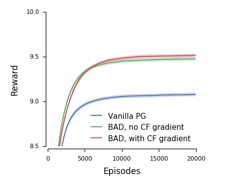

# 7.4.1 Matrix Game

~~정확한 matrix game에 대한 설명필요~~ 

여기선 첫째로, 2인용 2-step에 끝나는 partially observable matrix-like game에 실험을 진행하였습니다. 이 실험에서 각 agent의 state는 random bit로 이루어져있고, action space는 3개의 discrete action으로 구성되어 있는 상황입니다. 각 agent가 자신의 카드를 관찰하고, \(2-step game이므로, agent 1만\) 자신의 패에 대한 정보를 encoding하여 행동에 옮겨야하는 상황입니다. reward는 두 agent가 좋은 convention을 얻었을 때만 최대화 될 수 있는데 이는 2-step이므로, agent 1이 정보를 잘 전달할 수 있는 행동을 해 agent 2가 잘 알아듣고 행동했을 때를 의미합니다. 성능에 대해 아래의 그래프를 살펴보겠습니다.

이 실험에서 BAD는 baseline인  Vanila PG보다 압도적으로 좋은 것을 볼 수 있습니다. 또한 CF policy gradient는 $$\log\pi^a(u^a_t|\tau^a)$$를 $$\log(\hat{\pi}|\mathcal{B}_t,f^{\mathrm{pub}})$$단순히 선택된 action을 고려할 뿐만 아니라, 실행되지않은 action에 대해서도 고려를 하는 것이 가능합니다.그러나 이는 여기서 아주 적은 차이를 보입니다. 

