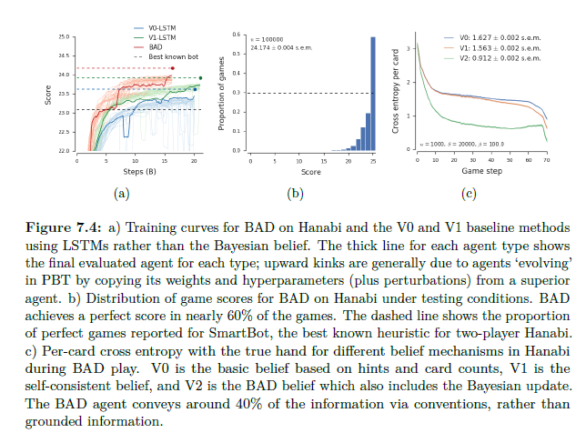

# 7.4.7 Results on Hanabi

BAD agent는 2인 Hanabi에서 SOTA를 달성하였습니다. 아래 그래프의 \(a\)를 보겠습니다.

이는 BAD agent와 두 LSTM agent의 training curve에 대한 그래프입니다. LSTM agent는 테스트할 때, 학습된 policy중에서 제일 좋은 버전을 사용해 조금 더 좋은 성능을 얻었습니다. agent를 고를 때, agent마다 10,000번의 게임을 통해 테스트를 진행하고, 가장 좋은 agent를 가지고 100,000 번의 테스트를 진행하였습니다. BAD agent를 고를 때도 비슷하게 사용하였는데, V1을 얼마나 섞는지에 대한 $$ \alpha$$와 hand에 몇장의 카드를 드느냐에 따라 추가적인 파라미터 선택이 있었습니다.

다른 method들 중에 20점이 안되는 method들은 가독성을 위해서 적지 않았고,  Hanabi의 룰에서 3번의 실패를하면 0점을 주도록 한 버전인데도 23.9점 정도로 여전히 heuristic rule보다 높은 성능을 보였습니다. 

 BAD의 agent의 실제 게임플레이는 모두 따르기 쉬운건 아니지만 게임을 분석해보았을 때, 몇몇 convention을 발견할 수 있었습니다. 모든 높은 점수를 받은 agent가 사용하는 convention으로 새 카드에 대해 빨간색이나 노란색이란 힌트를 주면 이는 등록해도 된다는 convention이 있었습니다. 또한 25%의 케이스에서는 새로운 카드에 대해 흰색이나 파란색을 가리키는 것이 버리라는 convention으로 사용되기도 하였습니다. 

 위 그림에서의 \(c\)에서는 V0, V1, V2의 iteration에 따른 cross entropy를 보입니다. belief update를 반복해서 진행할 경우, 기존의 cross entropy보다 크게 감소하는 것을 볼 수 있습니다. 이는 convention을 배우는 것이 성공적인 게임 플레이에 있어 중요하다는 점입니다.

