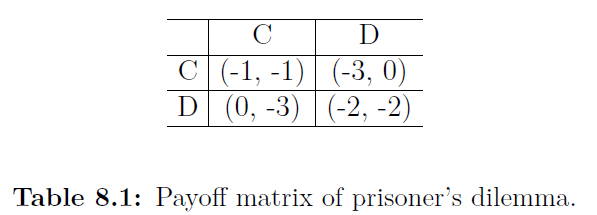
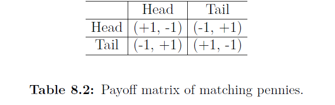

# 8.4.1 Iterated Games

여기서는 IPD와 IMP에 대해 실험하는데 어떻게 memory-1 two-agent MDP로 modeling하는지 설명합니다.

 먼저 IPD를 보자면, 위의 그림은 한 step에서 두 agent의 선택에 따른 각자 받는 reward를 나타내는 matrix입니다. 1 step으로 끝난다면, 내쉬 균형은 모두 Defeat하는 선택밖에 없습니다. 하지만 무한으로 반복된다면 내쉬 균형은 무한개가 존재하게 됩니다. 이 중 가장 눈여겨볼만한 policy에는 defeat strategy\(DD\)와 tit-for-tat\(TFT\)가 있습니다. TFT에서 각 agent는 처음엔 cooperation을하고, 다음부터는 상대의 action을 따라하는 것입니다. 이때 TFT와 DD 전 각각의 agent가 1 step에 받는 평균 reward는 -1과 -2입니다. 

Matching pennies는 zero-sum game으로, 각 step에서 각 agent가 받는 reward는 아래와 같습니다.

 이 게임에서는 내쉬 균형을 이루는 단 하나의 혼합전략\(head와 tail을 반반내는\) 만이 존재합니다.

 두 게임내의 agent들은 그들의 history에 따라 action을 취하게 되고, 이는 agent가 각 길이 $$K$$의 메모리를 통해 history를 보관할 수 있습니다. 결과적으로 이 $$K$$ step을 보고 action을 취하게 됩니다. Press는 memory 길이가 1인 좋은 전략을 가진 agent가 이 iterated게임을 memory가 1인 iterated 게임이 되도록 만들 수 있음\(memory 1만가지고도 우세하니 모두 memory 1만 가지게 되어\)을 보였습니다. 그러므로 여기서는 memory-1 iterated game으로 문제를 고려하기로 합니다.

 그리하여, IPD와 IMP를 memory length가 1인 두 agent의 MDP로 모델링합니다. 이 때 state 0 은 존재하지 않습니다. 

                                                                    $$ s_t = (u^1_{t-1},u^2_{t-1}), \ \ \mathrm{for}\ \  t \geq 1.$$

 각 agent의 policy는 다섯 가지 상황에 의해 action을 취하게 되는데, 항상 cooperation을 한다면 이는 맨 처음 $$\pi^a(C|s_0)$$, 그리고, 각 agent의 행동 DD,DC,CD,CC에 의한 4가지 policy $$ \pi^a(C|DD),\pi^a(C|DC),\pi^a(C|CD),\pi^a(C|CC)$$로 나타납니다. 

LOLA-Ex를 다른 algorithm과 비교하기 위해, 리그전 형식으로 비교하였습니다.

