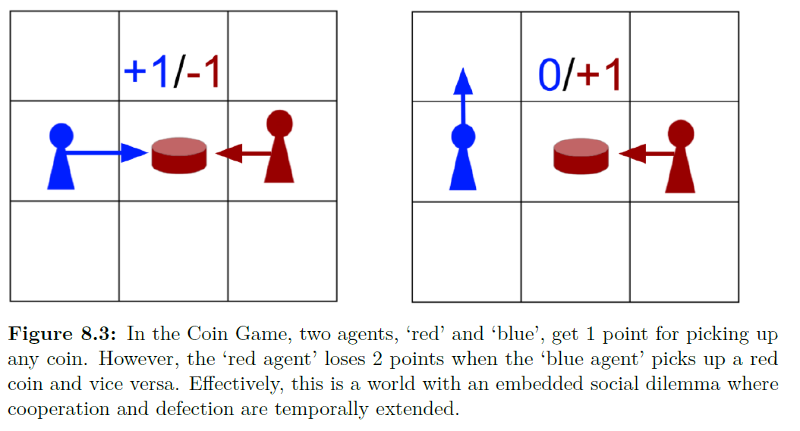

# 8.4.2 Coin Game

 다음으로, 좀더 높은 차원을 가지는 문제 Coin Game에 대해 분석합니다. 

 다음 그림과 같이, 빨간색 과 파란색 agent로 구성되었으며, coin을 모으는 것이 목적이 됩니다. 이 코인은 빨간색 혹은 파란색 둘 다 나올 수 있는데, 이는 agent가 하나를 모으게 되면 랜덤하게 생성됩니다. agents는 코인의 위치로 가서 코인을 수집하는데, 어떤 색의 코인이든 1점을 얻게되고, 만약 코인이 다른 색이면 다른 agent는 2점을 잃게 됩니다. 결과적으로 모든 agent가 코인을 마구 먹으려 든다면, 평균으로 0점을 얻게 됩니다. agent들은 recurrent network를 통해 구성되었고, 어떤 agent도 정확한 future discounted reward를 function 형태로 얻을 수 없습니다. policy gradient-based learning을 NL과 LOLA둘다에게 적용했고, 8.3.4에 나온 opponent modeling을 적용한 LOLA를 함께 실험에서 보입니다.

