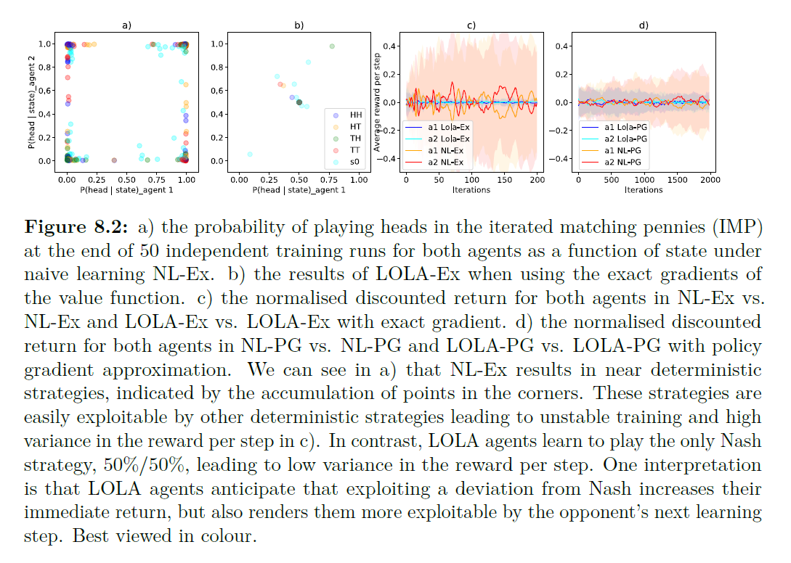
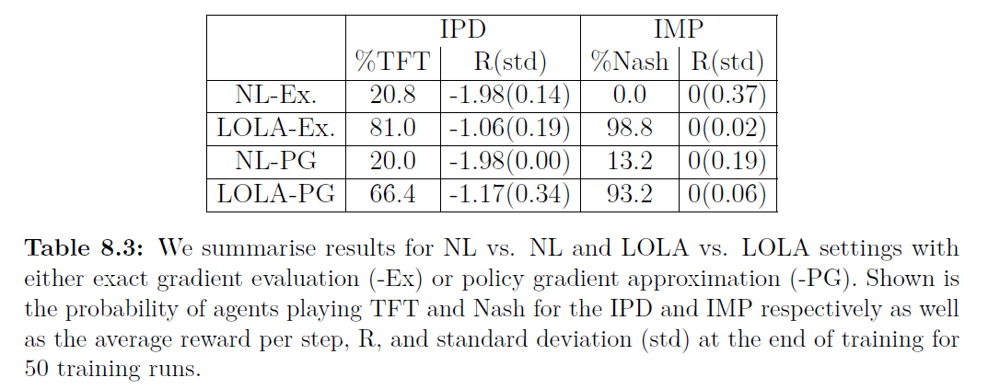
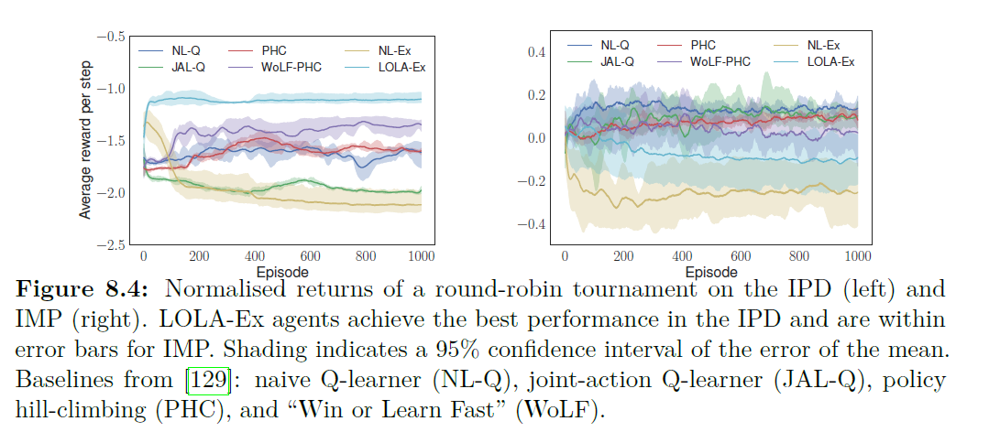

# 8.5.1 Iterated Games

가장 먼저 해볼 실험은, LOLA agent와 NL agent의 행동을 비교하는 것입니다. 

 다음 그래프의 \(a\)와 \(b\)는 학습이 끝난 후 agent들의 policy에 대한 그래프 입니다. \(a\)는 NL-Ex이고, \(b\)는 LOLA-Ex로 모두 $$\{J^1,J^2\}$$에 대한 hessian에 접근 가능합니다. 여기서는 오직 NL-Ex policy 그룹과  NOLA-Ex그룹 끼리에 대해 고려하고, 8.5.3에서 이런 혼합된 policy agent 그룹에서의 결과를 보입니다. 여기선 NL-Ex그룹은 무조건 defect하려하고, LOLA-Ex는 agent는 TFT를 배우게 되는 것을 볼 수 있습니다. $$s_0$$에서 cooperative하고, agent 2가 이전에 협력적이었던 CC와 DC에 관해서는 agent 1이 다음에 cooperative할 확률이 우세한 것을 볼 수 있습니다.

 결과적으로 \(c\)를 보면, LOLA-Ex 그룹의 normalized discounted reward는 -1에 가깝게 수렴하고, NL-Ex그룹은 -2에 수렴하는 것을 볼 수 있습니다. 

 \(d\)를 보면, LOLA-PG의 결과인데, 이도 마찬가지로 거의 비슷한 결과가 나왔음을 알 수 있습니다. 

 다음으로, 똑같이 IMP에 대해 실험한 결과에 대해 알아보겠습니다.

 이 게임에서는 NL agent가 수렴하는데 아예 실패하였습니다. 반면에, LOLA의 agent는 head와 tail을 반반씩 내야하는 내쉬균형에 이르렀음을 알 수 있습니다.

 다음의 Table을 통해 NL agent와 LOLA agent의 성능 차이를 자세히 볼 수 있습니다.

 IPD에서도 LOLA는 높은 비율로 TFT을 이뤘고, IMP에서도 내쉬 균형을 맞췄습니다. 학습의 안정성은 variance로 볼 수 있는데, IMP를 볼 때, 큰 차이가 남을 알 수 있습니다.

 다음으로는 다른 Algorithm과 LOLA를 비교해 보겠습니다.

 위의 그림에서 보시다시피 IPD에서 최고의 점수를 받음을 볼 수 있었습니다. 또 IMP에서는 제일 안정적인 모습을 보였습니다.

