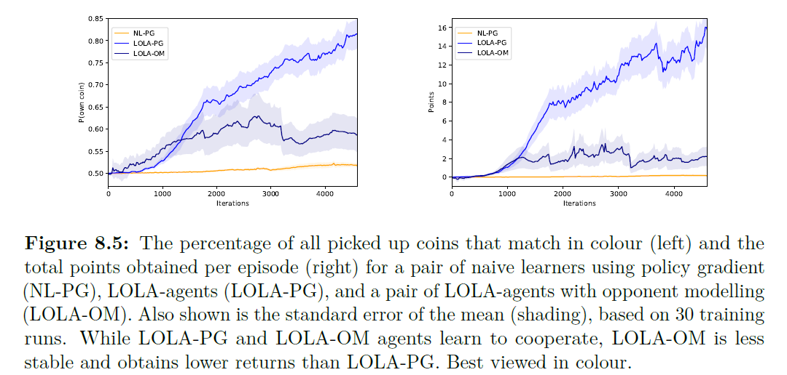

# 8.5.2 Coin Game

 Coin Game의 실험 결과는 LOLA의 확장성에 대해 실험한 것인데, NL-PG그룹과 NL-PG와 NL-LOLA-PG가 섞인 그룹, LOLA-PG그룹으로 나눠 비교하였습니다. 이는 다음 그래프와 같습니다.

 위 그래프에서 NL-PG agent는 코인을 마구잡이로 먹었으며\(Defeat전략\) 반면에 LOLA-PG agent들은 거의다 자신의 색과 맞는 색깔의 코인만 습득하기 시작했습니다. 이는 Coin Game에서도 agent끼리 cooperation하도록 LOLA algorithm이 유도한다는 것을 알 수 있습니다. 이 때, agent가 opponent에 대한 parameter를 모를 때에 대한 결과도 60%정도의 agents들이 자신의 색에만 맞는 코인을 습득하는 것을 보았습니다. 이 때 이러한 결과의 원인으로 opponent를 modeling하는 것이 정확하게 상대방의 parameter를 추정할 수 없기 때문에, 이렇게 큰 결과 차이를 내는 것임을 강조합니다. modeling과정에서 noise가 발생하고, 이는 variance와 bias를 만들어 냅니다.

