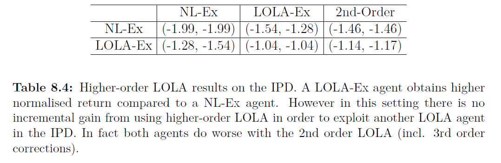

# 8.5.3 Exploitability of LOLA

 이번 section에서는 LOLA를 1차근사 말고 좀더 높은 차수로 근사하는 것에 대해 알아봅니다. IPD에서 정확한 expected discounted return을 계산할 수 있는 상황을 가정할 것인데, 이는 Policy-gradient방식을 사용할 때, 차수가 커질수록 variance가 커지기 때문에 이를 통제하기 위함입니다. 이를 다음 표와 같은 6개의 그룹으로 나누어 비교를 해보았습니다.

 LOLA-Ex agent는 LOLA-Ex와 만나야 가장 높은 return을 받게되었고, naive agent들을 LOLA-Ex agent와 같이 행동하도록 만들었습니다. 그리고 2nd-order LOLA는 LOLA-Ex와 함께 그룹이 되었을 때, 좋은 효과가 나기보다 오히려 LOLA-Ex끼리의 그룹보다 낮은 성능을 보였습니다. 이 실험이 LOLA끼리의 그룹이 절대적이라는 것은 아니지만 gradient-based learning을 할 때도 어떤 결과를 보일지 대략적으로 알 수 있었습니다.

 

