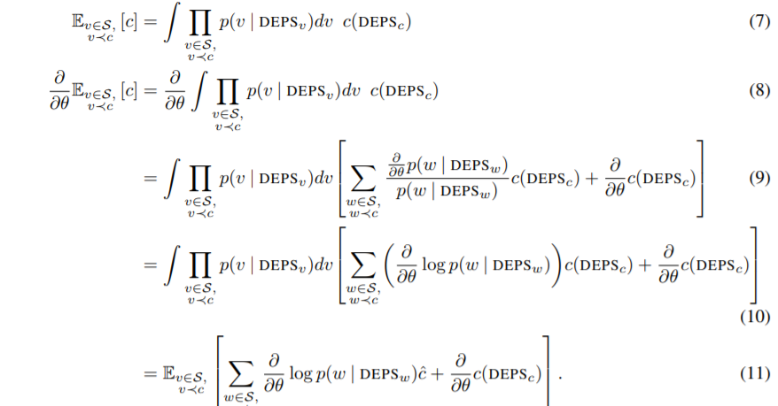
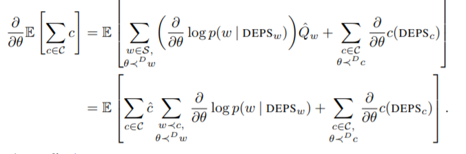

# 9.2.2 Surrogate Losses

cost node의 estimate gradients를 얻기 위해서 Schulman은 다음과 같은 surrogate loss를 제안했습니다.

                              $$ {SL}(\Theta,\mathcal{S}) = \sum_{w\in\mathcal{S}}\log p(w|\mathrm{DEPS}_w)\hat{Q}_w + \sum_{c\in\mathcal{C}}c(\mathrm{DEPS}_c)$$

$$\mathrm{DEPS_w}$$는 $$w$$에 deterministic하게 영향을 미치는 stochastic nodes나 input nodes입니다.

$$ \hat{Q}_w$$는 $$w$$에 영향을 받는 sampled costs $$ \hat{c}$$의 합입니다. 

 SL은 한번 미분됐을 때, 다음과 같은 gradient estimator로 표현 가능합니다.

                                                                   $$ \nabla_{\theta}\mathcal{L} = \mathbb{E}[\nabla_{\theta}\mathrm{SL}(\Theta,\mathcal{S})]$$

 이 때, $$\hat{Q}_w$$는 SL안에서 고정된 sample로 취급되므로,\($$\theta$$에 대해 영향을 받지 않습니다.\) 이는 기존 SCG에서의 의존성이  분리됩니다. 이렇게되면, SL의 1차 gradient가 $$\log(p)\nabla_{\theta}Q$$의 form을 포함하지 않고도 score function estimator가 됩니다.

 맨 위의 $$SL$$에 대한 정의는 다음과 같이 증명할 수 있습니다.\(9.2에서 사용한 테크닉과 같습니다.\)

