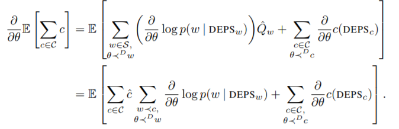

# 9.4.2 Casuality

 이전까지 gradient estimator는 두가지 방식으로 나타나졌습니다.

1. 첫째 term에 대한 설명이 좀 다른데 잘못 표기되었다 생각하고 제 생각대로 쓰면 다음과 같습니다.  sampled cost $$\hat{c}$$의 합에 $$\nabla\log(p(w))$$를 곱해 합을 구하는 형식으로 얻어집니다.
2. 둘째 term은, 각 cost에 대해 log prob gradient합이 곱해집니다.

 두 gradient estimator 모두 일반적인 모든 cost의 합을 곱하는 방식보다 variance가 줄어드는 효과가 있습니다. SL의 접근은 첫번째 표현식을, DiCE는 두번째 표현식을 기반으로 두었습니다. Schulman은 두 표현식이 결과적으로 같은 term을 가져온다고 했으나, 두번째 표현식이 높은 차수를 계산할 때 훨씬 많이 복잡성이 낮아집니다. 그 이유는 gradient estimator가 $$\mathcal{W}_{c^n} = \mathcal{W}_{c^n+1} $$를 활용할 수 있기 때문입니다. 첫번째는 계속 sampling을 통해 $$\hat{Q}$$를 구해야함. 반면에 SL은 미분됐을 때, 그에 의존성이 있는 stochastic nodes가 계속 관련되면서 복잡성이 커집니다. 결과적으로 DiCE의 objective가 제일 직관적이고 개념적으로 원래의 목표를 중심으로 한다고 생각해 두번째 term을 기반으로 했다고 말합니다.

