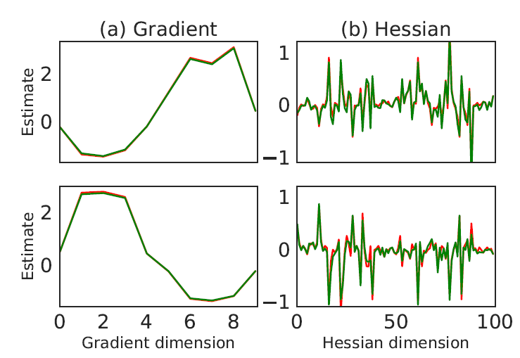
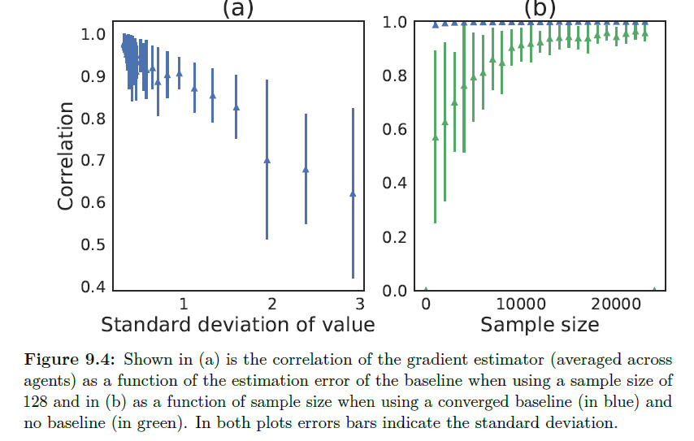

# 9.5.1 Empirical Verification

 첫번째로 실험한 것은 DiCE가 SCG에서 gradient와 hessian을 잘 찾아내는가에 대한 실험이었습니다. 이를 실험하기 위해서 IPD환경에서 fixed policies를 가지고 진행을 하였습니다. 

 위의 그래프를 보면, \(a\)는 gradient, \(b\)는 hessian 입니다. red가 true value, green이 estimated value인데, 거의 일치하는 것을 볼 수 있습니다. 

또한 위의 \(a\)그래프를 보면, value function이 정밀해질수록 gradient 추정값이 어떻게 정확해지는지 보입니다. value function의 variance이 작아질수록, baseline 추정 오차에 대한 함수로써 gradient estimator와 correlation이 높아지는 것을 볼 수 있습니다. \(b\)에선 sample size와  baseline에 대해 실험했는데, baseline을 적용한 것이 sample size가 적어도 굉장히 효율적임을 볼 수 있습니다. 이 두 실험 모두 baseline이 DiCE의 아주 중요한 요소임을 보여주고 있습니다.

