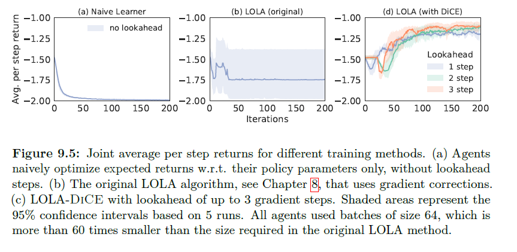

# 9.5.2 DiCE For multi-agent RL

이전 chapter에서 LOLA를 소개했었는데, 이는 opponent의 학습과정을 자신의 학습에 끌여들여 학습해 IPD에서 좋은 내쉬균형을 이룬 것을 보았습니다. 일반적인 policy gradient의 학습은 다른 agent에 대한 의존이 없습니다. LOLa는 테일러급수를 통해 상대방의 증분에 대한 근사를 할수 있게 되고, 이를 이용해 update term을 만들면 2차 gradient가 발생하게 됩니다. 이번 chapter에서는 DiCE를 통해 좀더 직접적으로 접근해 보겠습니다.

 $$\pi_{\theta^1} $$는 LOLA agent, $$\pi_{\theta^2}$$는 opponent로 정의합니다. opponent는 policy gradient를 통해 학습한다고 할 때, LOLA-DiCE agent는 다음과같은 stochastic objective를 가지게 됩니다.

                                                   $$ \mathcal{L}^1(\theta^1,\theta^2)_{\mathrm{LOLA}} = \mathbb{E}_{\pi_\theta^1,\pi_{\theta^2+\Delta\theta^2(\theta^1,\theta^2)}}[\mathcal{L^1}],\\ \mathrm{where}\ \  \Delta\theta^2(\theta^1,\theta^2) = \alpha\nabla_{\theta^2}\mathbb{E}_{\pi_{\theta^1},\pi_{\theta^2}}[\mathcal{L^2}]$$

$$\alpha$$는 learning rate이고, $$\mathcal{L}^a = \sum^T_{t=0}\gamma^tr^a_t$$ 입니다. SCG 형태로 만들기 위해, $$J^a$$형태가 아닌 $$\mathcal{L}$$로 정의하였습니다. 이 term들을 직접 평가하기 위해 LOLA의 변형으로 opponent의 learning process를 전체를 보는데\(이전 time step에 대한 action들을 봐야하기 때문에 unroll이라고 표현\) model-agnostic meta-learning\(MAML\)이라는 것과 닮았습니다. 이를 MAML의 형태로 공식을 쓰면, opponent의 gradient update양 $$\Delta\theta^2$$는 inner loop에 대응되고, agent 자신의  학습은 outer loop에서 하게됩니다.

 다음과 같은 DiCE-objective를 쓰면 모든 의존성을 보존한채 식을 사용할 수 있습니다.

                                                             $$ \mathcal{L}^a_{\square(\theta^1,\theta^2)} = \sum_t\square (\{u^{a' \in \{1,2\}}_{t' \leq t}\})\gamma^t r^a_t$$

 계산적인 이유로 inner loop에서 $$\Delta \theta^a$$를 저장해놓고 사용합니다.\(반복 계산을 막기위해\)

 중요한 것은  LOLA의 성능은 높은 차수의 정확한 gradient값에 영향을 많이 받는 편이기 때문에 DiCE를 사용하여$$\Delta \theta^2$$를 구하는 것은 아주 중요한 일입니다. 반면에 SL-based 1차 gradient estimator를 사용한 Finn의 연구에서는 AL-Shedivat의 연구에서 주장했던 것 처럼 결과가 좋지 않았습니다.

LOLA-DiCE agent와 다른 LOLA의 agent 성능을 비교하면, LOLA는 opponent의 one-step만을 학습에 이용할 수 있지만, DiCE는 이전의 action에 대한 모든 정보가 있기 때문에, n-step에 대해 학습할 수가 있습니다.

2차 gradient를 가진 원래 LOLA는 안정적이지도않고 엄청나게 큰 batch size를 요구했으나, LOLA-DiCE는 결과도 좋으면서 안정적인 학습을 이뤄냈습니다.

